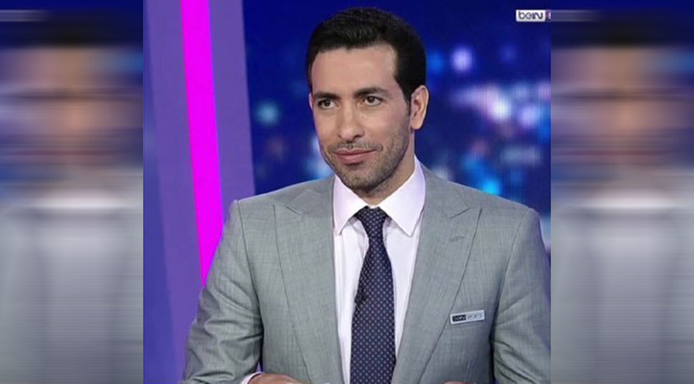
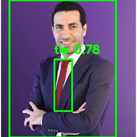

# Abu Treika Detection with YOLOv8

Object detection project to detect **Mohamed Abu Treika** — the legendary Egyptian footballer — using YOLOv8 fine-tuned on a custom dataset.

---

## The Problem

The standard YOLOv8n model (trained on COCO) has no concept of *who* a person is — it only detects "person" generically. This project fine-tunes YOLOv8 to specifically recognize Abu Treika in images.

| Before Fine-Tuning | After Fine-Tuning |
|---|---|
| Detected as **person** ❌ | Detected as **Abu Treika** ✅ |

**Sample input:**



**Output after COCO inference (generic "person"):**



---

## Approach

1. **Baseline** — Run pretrained `yolov8n.pt` (COCO) — detects "person" only
2. **Dataset** — Collected and annotated Abu Treika images using [Roboflow](https://roboflow.com)
3. **Fine-tuning** — Trained YOLOv8n on the custom dataset with heavy augmentation
4. **Evaluation** — Measured mAP50 and mAP50-95 on validation set
5. **Dual inference** — COCO model (blue) + fine-tuned model (green) side by side

---

## Results

| Metric | Value |
|---|---|
| mAP50 | 0.747 |
| mAP50-95 | 0.529 |
| Recall | 1.000 |

> Note: dataset is small (12 training images). Adding more images will significantly improve results.

---

## Setup

```bash
git clone https://github.com/YOUR_USERNAME/abutreika-detection-yolov8.git
cd abutreika-detection-yolov8

python -m venv .venv
source .venv/bin/activate
pip install ultralytics roboflow
```

---

## Usage

Open `yolov8_inference.ipynb` and run cells in order:

| Part | Description |
|---|---|
| Part 1 | Baseline inference with pretrained YOLOv8 (COCO) |
| Part 2 | Download custom dataset from Roboflow |
| Part 3 | Fine-tune on Abu Treika dataset with augmentation |
| Part 4 | Compare COCO vs fine-tuned model side by side |

---

## Tech Stack

- [Ultralytics YOLOv8](https://github.com/ultralytics/ultralytics)
- [Roboflow](https://roboflow.com) — dataset annotation and augmentation
- OpenCV, Matplotlib
